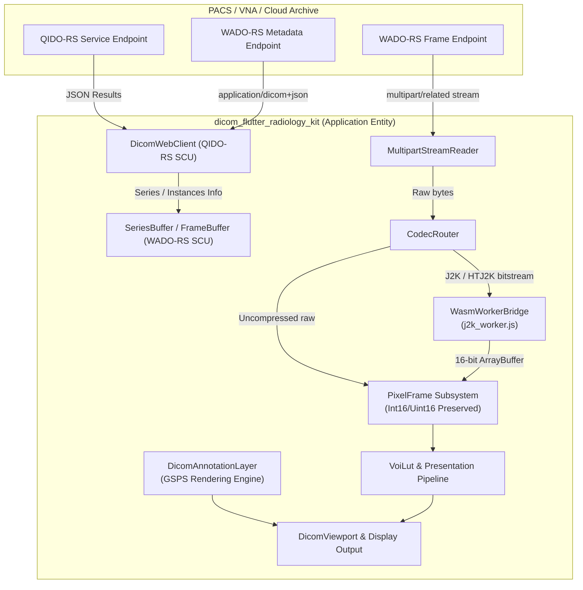
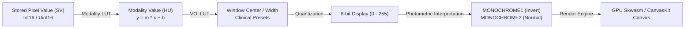

# DICOM Conformance Statement

**GoSmartHealth DICOM Flutter Radiology Kit (`dicom_flutter_radiology_kit`)**  
**Document ID:** DCS-GFRK-001  
**Software Version:** 0.0.1+  
**Date:** September 2026  
**Standard Compliance:** NEMA PS 3.2 (DICOM Conformance)  

---

## 1. Conformance Statement Overview

The **GoSmartHealth DICOM Flutter Radiology Kit** (`dicom_flutter_radiology_kit`) is a medical imaging software library designed for clinical review, diagnostic workstations, and embedded healthcare web/desktop applications built with Flutter (Dart 3+ WasmGC, Skwasm/CanvasKit). 

The application implements a DICOMweb Service Class User (SCU) interface supporting Query/Retrieve via RESTful protocols (**QIDO-RS** and **WADO-RS**) as defined in DICOM PS 3.18 (Web Services). It performs zero-jank frame streaming, offloaded WebAssembly (WASM) decompression for high-bit-depth medical images, dynamic 16-bit scalar Modality/VOI Look-Up Table (LUT) transformations, Grayscale Softcopy Presentation State (GSPS) display and authoring, and precision physical metric measurements.

> [!CAUTION]
> **REGULATORY & CLINICAL VALIDATION NOTICE**
> 
> `dicom_flutter_radiology_kit` is distributed as a reusable software component/library for educational, research, evaluation, and software integration purposes. It is **NOT** an independently certified or cleared medical device.
> 
> Any developer, OEM, or healthcare organization incorporating this software into a clinical product, diagnostic workstation, or Software as a Medical Device (SaMD) assumes full legal and regulatory responsibility as the **Medical Device Manufacturer**. The integrating entity must perform complete Software Verification and Validation (V&V), Clinical Evaluation, Usability Engineering (IEC 62366-1), and Risk Management (ISO 14971) in accordance with applicable medical device regulations (e.g., FDA 21 CFR 820 / 510(k), CE Mark under EU MDR 2017/745, PMDA, or local jurisdictions) prior to clinical deployment.

### Table 1-1: Network Services Overview (DICOMweb REST Services)

| Network Service | User of Service (SCU) | Provider of Service (SCP) | Comments |
| :--- | :---: | :---: | :--- |
| **QIDO-RS (Search)** | | | |
| SearchForStudies (`/studies`) | **Yes** | No | Search across PACS/VNA by Patient ID, Name, Modality, Date |
| SearchForSeries (`/studies/.../series`) | **Yes** | No | Search series within a study |
| SearchForInstances (`/studies/.../series/.../instances`) | **Yes** | No | Search instance metadata and frame indexes |
| **WADO-RS (Retrieve)** | | | |
| RetrieveStudy / RetrieveSeries Metadata (`/metadata`) | **Yes** | No | Returns `application/dicom+json` instance summaries |
| RetrieveFrames (`/frames/{frameList}`) | **Yes** | No | Stream uncompressed raw scalar bytes or JPEG 2000 bitstreams |
| RetrieveRendered | No | No | Not utilized; kit renders raw 16-bit scalar frames client-side |
| **STOW-RS (Store)** | | | |
| StoreInstances (`/studies`) | *Planned* | No | GSPS softcopy presentation state upload planned for future release |

### Table 1-2: Grayscale Softcopy Presentation State (GSPS) Overview

| SOP Class Name | SOP Class UID | Role | Comments |
| :--- | :--- | :---: | :--- |
| **Grayscale Softcopy Presentation State Storage** | `1.2.840.10008.5.1.4.1.1.11.1` | **SCU / Display** | Interactive rendering and JSON serialization of `POLYLINE`, `CIRCLE`, `ELLIPSE`, and `TEXT` objects |

### Table 1-3: Supported Transfer Syntaxes for Frame Streaming

| Transfer Syntax Name | Transfer Syntax UID | Client Decoding Mode |
| :--- | :--- | :--- |
| **Implicit VR Little Endian** | `1.2.840.10008.1.2` | Native Dart Little-Endian Parser |
| **Explicit VR Little Endian** | `1.2.840.10008.1.2.1` | Native Dart Little-Endian Parser |
| **JPEG 2000 Image Compression (Lossless Only)** | `1.2.840.10008.1.2.4.90` | Dedicated Web Worker via WebAssembly (OpenJPEG WASM) |
| **High-Throughput JPEG 2000 (HTJ2K) Image Compression (Lossless Only)** | `1.2.840.10008.1.2.4.201` | Dedicated Web Worker via WebAssembly (OpenJPH WASM) |
| **High-Throughput JPEG 2000 (HTJ2K) with RPCL Options** | `1.2.840.10008.1.2.4.203` | Dedicated Web Worker via WebAssembly (OpenJPH WASM) |

---

## 2. Table of Contents

- [1. Conformance Statement Overview](#1-conformance-statement-overview)
- [2. Table of Contents](#2-table-of-contents)
- [3. Introduction](#3-introduction)
  - [3.1 Revision History](#31-revision-history)
  - [3.2 Audience](#32-audience)
  - [3.3 Remarks](#33-remarks)
  - [3.4 Definitions, Terms, and Abbreviations](#34-definitions-terms-and-abbreviations)
  - [3.5 Normative References](#35-normative-references)
- [4. Networking](#4-networking)
  - [4.1 Implementation Model](#41-implementation-model)
    - [4.1.1 Application Data Flow](#411-application-data-flow)
    - [4.1.2 Functional Definition of Application Entities (AEs)](#412-functional-definition-of-application-entities-aes)
    - [4.1.3 Sequencing of Real-World Activities](#413-sequencing-of-real-world-activities)
  - [4.2 AE Specifications](#42-ae-specifications)
    - [4.2.1 DICOMweb REST Client Application Entity](#421-dicomweb-rest-client-application-entity)
- [5. Media Interchange](#5-media-interchange)
- [6. Support of Character Sets](#6-support-of-character-sets)
- [7. Security Profiles](#7-security-profiles)
- [8. Annexes](#8-annexes)
  - [Annex A: Supported Storage SOP Classes (SCU)](#annex-a-supported-storage-sop-classes-scu)
  - [Annex B: Grayscale Softcopy Presentation State (GSPS) Conformance](#annex-b-grayscale-softcopy-presentation-state-gsps-conformance)
  - [Annex C: Transformation & Display Pipeline Conformance](#annex-c-transformation--display-pipeline-conformance)
  - [Annex D: Clinical Measurement & Calibration Conformance](#annex-d-clinical-measurement--calibration-conformance)
  - [Annex E: DICOM Data Dictionary & Element Dump Conformance](#annex-e-dicom-data-dictionary--element-dump-conformance)

---

## 3. Introduction

### 3.1 Revision History

| Document Version | Date | Author / Organization | Description of Changes |
| :--- | :--- | :--- | :--- |
| **0.0.1** | September 2026 | GoSmartHealth Engineering Team | Initial draft covering QIDO-RS, WADO-RS, 16-bit scalar display pipeline, GSPS annotations, and physical metric calibrations. |

### 3.2 Audience

This document is intended for hospital PACS administrators, biomedical engineers, system integrators, software developers, and regulatory compliance reviewers evaluating the interoperability of `dicom_flutter_radiology_kit` with enterprise medical image archives (PACS/VNA), imaging modalities, and cloud imaging systems.

### 3.3 Remarks & Clinical Validation Disclaimer
 
The scope of this DICOM Conformance Statement is to describe the integration capabilities and communication interfaces of the `dicom_flutter_radiology_kit` software package. 

- **Conformance vs. Clinical Interoperability**: DICOM conformance alone does not guarantee total clinical interoperability or diagnostic efficacy; it defines the standard syntactic and semantic baseline for medical image data interchange. Verification against specific vendor archives and imaging modalities is recommended.
- **Integrator Validation Requirement**: This software library does not constitute an end-user clinical diagnostic medical device. Any party integrating this toolkit into a clinical or commercial solution must validate the entire software-hardware chain (including display monitors, ambient luminance conditions, input devices, and host application logic) in accordance with the target product's intended use and governing regulatory standards (e.g., FDA 21 CFR 820, IEC 62304, ISO 13485, and EU MDR).
- **Display Calibration**: Accurate clinical review requires displays calibrated to the DICOM Grayscale Standard Display Function (GSDF, PS 3.14) or applicable diagnostic display quality standards (e.g., AAPM TG18 / ACR-AAPM-SIIM Technical Standards). Calibration is the responsibility of the system deployment team.

### 3.4 Definitions, Terms, and Abbreviations

- **AE**: Application Entity
- **Cobb Angle**: 3-point angular measurement between spinal or skeletal anatomical vectors
- **CR / DX**: Computed Radiography / Digital Radiography
- **CT**: Computed Tomography
- **DICOM**: Digital Imaging and Communications in Medicine
- **GSPS**: Grayscale Softcopy Presentation State
- **HTJ2K**: High-Throughput JPEG 2000 (Part 15)
- **HU**: Hounsfield Unit
- **IOD**: Information Object Definition
- **J2K**: JPEG 2000 (Part 1)
- **LUT**: Look-Up Table (Modality LUT, VOI LUT)
- **MR**: Magnetic Resonance
- **PACS**: Picture Archiving and Communication System
- **QIDO-RS**: Query based on ID for DICOM Objects by RESTful Services
- **SCU**: Service Class User (client)
- **SOP**: Service-Object Pair
- **UID**: Unique Identifier
- **US**: Ultrasound
- **VNA**: Vendor Neutral Archive
- **VOI**: Value of Interest
- **VR**: Value Representation
- **WADO-RS**: Web Access to DICOM Objects by RESTful Services
- **WASM**: WebAssembly (WasmGC)

### 3.5 Normative References

- **NEMA PS 3.1 - 3.22**: Digital Imaging and Communications in Medicine (DICOM) Standard, National Electrical Manufacturers Association, Rosslyn, VA, USA.
  - **PS 3.2**: Conformance
  - **PS 3.3**: Information Object Definitions
  - **PS 3.4**: Service Class Specifications
  - **PS 3.5**: Data Structures and Encoding
  - **PS 3.11**: Media Storage Application Profiles
  - **PS 3.14**: Grayscale Standard Display Function (GSDF)
  - **PS 3.18**: Web Services (DICOMweb)

---

## 4. Networking

### 4.1 Implementation Model

#### 4.1.1 Application Data Flow

The `dicom_flutter_radiology_kit` Application Entity operates as a pure RESTful client:
1. Queries the PACS/VNA via **QIDO-RS** to list matching studies, series, or instances.
2. Retrieves full DICOM JSON metadata via **WADO-RS** `/metadata`.
3. Streams individual frame pixel payloads asynchronously via **WADO-RS** `/frames/{frameList}`.
4. Offloads compressed frame bytes (`image/jp2`, `image/jph`) to isolated Web Workers executing WebAssembly decoders, preventing UI thread blocking.
5. Ingests raw scalar samples directly into memory (`PixelFrame`), preserving true 16-bit bit depth.
6. Dynamically evaluates Modality LUT (Rescale Slope/Intercept) and Value of Interest (VOI) LUT (Window Center/Width) calculations in real time.
7. Overlays DICOM PS 3.3 Grayscale Softcopy Presentation State (GSPS) vector graphics and text annotations anchored directly to image pixel coordinates.

#### 4.1.2 Functional Definition of Application Entities (AEs)

The `DicomWebClient` Application Entity acts as an SCU for all network interactions:
- **Study Query**: Sends HTTP GET requests to QIDO-RS `/studies` endpoints with URL query filters.
- **Metadata Retrieval**: Sends HTTP GET requests to WADO-RS `/studies/{StudyInstanceUID}/series/{SeriesInstanceUID}/metadata` requesting `application/dicom+json`.
- **Frame Retrieval**: Sends HTTP GET requests to WADO-RS `/studies/{StudyInstanceUID}/series/{SeriesInstanceUID}/instances/{SOPInstanceUID}/frames/{frameList}` requesting either `multipart/related; type="application/octet-stream"` or `multipart/related; type="image/jp2"`.
- **LRU Memory Cache**: `DicomSeriesBuffer` enforces a bounded memory footprint with Least-Recently-Used (LRU) pixel frame caching.

#### 4.1.3 Sequencing of Real-World Activities

1. **Server Connection**: User enters or selects a PACS DICOMweb base root URL.
2. **Study Discovery**: User executes a search filter (Patient Name, Patient ID, Modality, Date).
3. **Series Selection**: User selects a series; client fetches instance metadata in JSON format.
4. **Frame Streaming**: Viewport initializes and asynchronously fetches pixel frames as the user scrolls slices or plays cine loops.
5. **Image Adjustment**: User adjusts Window Width/Center ($W/L$) or zooms/pans the viewport; the rendering pipeline recalculates without re-downloading pixels.
6. **Annotation & Measurement**: User draws calipers, angles, polylines, circles, or ellipses; physical metric distances ($\text{mm}$) and areas ($\text{mm}^2 / \text{cm}^2$) are calculated and can be serialized as GSPS JSON objects.

---

### 4.2 AE Specifications

#### 4.2.1 DICOMweb REST Client Application Entity

##### 4.2.1.1 QIDO-RS Study Search Specifications

`DicomWebClient` initiates QIDO-RS HTTP GET requests to query DICOM studies:

- **Resource URL**: `{BaseURL}/studies`
- **Supported Query Parameters**:

| Parameter Key | DICOM Tag | VR | Description |
| :--- | :--- | :---: | :--- |
| `PatientID` | `(0010,0020)` | LO | Patient identifier matching (exact match or wildcard `*`) |
| `PatientName` | `(0010,0010)` | PN | Patient full name matching |
| `AccessionNumber` | `(0008,0050)` | SH | Accession number matching |
| `StudyDate` | `(0008,0020)` | DA | Study date matching (single date `YYYYMMDD` or range `YYYYMMDD-YYYYMMDD`) |
| `ModalitiesInStudy` | `(0008,0061)` | CS | Modality filtering (e.g., `CT`, `MR`, `DX`, `CR`, `US`) |
| `limit` | N/A | Integer | Pagination maximum return count |
| `offset` | N/A | Integer | Pagination record offset |
| `includefield` | N/A | String | Specific attribute inclusion requests |

- **Expected Response Header**: `Content-Type: application/dicom+json`
- **Required Parsed Attributes**:
  - `(0020,000D)` Study Instance UID
  - `(0010,0010)` Patient's Name
  - `(0010,0020)` Patient ID
  - `(0010,0030)` Patient's Birth Date
  - `(0008,0020)` Study Date
  - `(0008,0030)` Study Time
  - `(0008,0050)` Accession Number
  - `(0008,0061)` Modalities in Study
  - `(0008,1030)` Study Description
  - `(0020,1206)` Number of Study Related Series
  - `(0020,1208)` Number of Study Related Instances

##### 4.2.1.2 WADO-RS Metadata Retrieval Specifications

- **Resource URL**: `{BaseURL}/studies/{StudyInstanceUID}/series/{SeriesInstanceUID}/metadata`
- **Request Header**: `Accept: application/dicom+json`
- **Required Parsed Attributes per Instance**:
  - `(0008,0018)` SOP Instance UID
  - `(0020,0013)` Instance Number
  - `(0028,0010)` Rows
  - `(0028,0011)` Columns
  - `(0028,0100)` Bits Allocated (typically 8 or 16)
  - `(0028,0101)` Bits Stored (typically 8, 12, 14, or 16)
  - `(0028,0102)` High Bit
  - `(0028,0103)` Pixel Representation (`0` = unsigned, `1` = signed 2's complement)
  - `(0028,0004)` Photometric Interpretation (`MONOCHROME1`, `MONOCHROME2`)
  - `(0028,1050)` Window Center
  - `(0028,1051)` Window Width
  - `(0028,1052)` Rescale Intercept
  - `(0028,1053)` Rescale Slope
  - `(0028,0030)` Pixel Spacing ($[\Delta y, \Delta x]$ in millimeters)
  - `(0018,1164)` Imager Pixel Spacing (fallback for projection radiography)
  - `(5200,9229)` / `(5200,9230)` Enhanced CT Functional Groups Sequences (Pixel Measures Sequence)

##### 4.2.1.3 WADO-RS Frame Retrieval Specifications

- **Resource URL**: `{BaseURL}/studies/{StudyInstanceUID}/series/{SeriesInstanceUID}/instances/{SOPInstanceUID}/frames/{frameList}`
- **Supported Content Negotiation Accept Headers**:
  - **Raw Uncompressed**:
    `Accept: multipart/related; type="application/octet-stream"; transfer-syntax="1.2.840.10008.1.2.1"`
  - **JPEG 2000 Lossless**:
    `Accept: multipart/related; type="image/jp2"; transfer-syntax="1.2.840.10008.1.2.4.90"`
  - **HTJ2K Lossless**:
    `Accept: multipart/related; type="image/jph"; transfer-syntax="1.2.840.10008.1.2.4.201"`

---

## 5. Media Interchange

The kit focuses primarily on networked DICOMweb streaming. Offline media interchange (DICOM Part 10 files on CD-R, DVD, or USB) is supported via memory buffers (`Uint8List`) and file stream adapters capable of ingesting raw DICOM datasets into `PixelFrame` structures.

---

## 6. Support of Character Sets

`dicom_flutter_radiology_kit` provides full support for character encoding as defined in DICOM PS 3.5:

| Defined Term | Character Set Description | ISO Registration Number |
| :--- | :--- | :--- |
| *Default* (none) | US-ASCII (Basic 7-bit) | ISO-IR 6 |
| `ISO_IR 100` | Latin Alphabet No. 1 (Western European) | ISO-IR 100 |
| `ISO_IR 192` | Unicode UTF-8 | ISO-IR 192 |

Patient names encoded in standard DICOM format (`Family^Given^Middle^Prefix^Suffix`) are automatically normalized to human-readable presentation format (e.g., `Family, Given Middle`).

---

## 7. Security Profiles

### 7.1 Transport Security
- All network communication with PACS/VNA servers supports encrypted transport over **HTTPS / TLS 1.2 and TLS 1.3**.
- Modern browser Certificate Authority (CA) validation and CORS policies are strictly enforced on Flutter Web.

### 7.2 Authentication & Authorization
- `DicomWebClient` supports HTTP `Authorization` headers, enabling integration with:
  - **OAuth 2.0 / OpenID Connect (OIDC)** Bearer tokens.
  - Basic Authentication (for protected local development gateways).
  - Custom proxy authorization tokens.

### 7.3 Patient Privacy & Data Hygiene
- **Zero Persistent PHI Caching**: By default, raw pixel frames and demographic attributes reside solely in volatile application memory (`DicomSeriesBuffer` LRU cache) and are freed upon session disposal or navigation.
- **De-Identification**: Presentation state objects and clinical exports conform to HIPAA / GDPR safe-harbor standards when serialized, omitting direct patient identifiers unless explicitly configured.

---

## 8. Annexes

### Annex A: Supported Storage SOP Classes (SCU)

The client application entity can retrieve, decode, and render instances belonging to the following Standard SOP Classes:

| SOP Class Name | SOP Class UID | Clinical Domain |
| :--- | :--- | :--- |
| **CT Image Storage** | `1.2.840.10008.5.1.4.1.1.2` | Computed Tomography (Axial, Coronal, Sagittal) |
| **Enhanced CT Image Storage** | `1.2.840.10008.5.1.4.1.1.2.1` | Multi-frame Enhanced Computed Tomography |
| **MR Image Storage** | `1.2.840.10008.5.1.4.1.1.4` | Magnetic Resonance Imaging |
| **Enhanced MR Image Storage** | `1.2.840.10008.5.1.4.1.1.4.1` | Multi-frame Enhanced MR Imaging |
| **Secondary Capture Image Storage** | `1.2.840.10008.5.1.4.1.1.7` | Digitized radiographs, screenshots, reports |
| **Digital X-Ray Image Storage - For Presentation** | `1.2.840.10008.5.1.4.1.1.1.1` | Digital Radiography (Chest, Skeletal DX) |
| **Computed Radiography Image Storage** | `1.2.840.10008.5.1.4.1.1.1` | CR cassette imaging |
| **Ultrasound Multi-frame Image Storage** | `1.2.840.10008.5.1.4.1.1.3.1` | Dynamic multi-frame cine ultrasound |
| **Grayscale Softcopy Presentation State Storage** | `1.2.840.10008.5.1.4.1.1.11.1` | Softcopy annotations, calipers, GSPS layers |

---

### Annex B: Grayscale Softcopy Presentation State (GSPS) Conformance

`dicom_flutter_radiology_kit` conforms to DICOM PS 3.3 (Information Object Definitions) Clause C.10.5 for the **Graphic Annotation Module** and **Text Object Module**.

#### B.1 Graphic Object Sequence (`0070,0009`)

All graphic annotations maintain exact image-coordinate anchoring in **Image Pixel Coordinates** (`GraphicAnnotationUnits = "PIXEL"`), remaining locked to the anatomy under dynamic zooming ($0.1\times - 20.0\times$) and panning.

| Clinical Tool | DICOM `GraphicType` (`0070,0023`) | Number of Graphic Points (`0070,0021`) | Data Format in `GraphicData` (`0070,0022`) |
| :--- | :--- | :---: | :--- |
| **Caliper** | `POLYLINE` | 2 | $[x_1, y_1, x_2, y_2]$ |
| **Angle (Cobb)** | `POLYLINE` | 3 | $[x_{p1}, y_{p1}, x_{\text{vertex}}, y_{\text{vertex}}, x_{p2}, y_{p2}]$ |
| **Polyline** | `POLYLINE` | $N \ge 2$ | $[x_1, y_1, x_2, y_2, \dots, x_N, y_N]$ |
| **Closed Polygon** | `POLYLINE` | $N \ge 4$ | $[x_1, y_1, \dots, x_N, y_N, x_1, y_1]$ (First point repeated at end) |
| **Circle** | `CIRCLE` | 2 | $[x_{\text{center}}, y_{\text{center}}, x_{\text{perimeter}}, y_{\text{perimeter}}]$ |
| **Ellipse** | `ELLIPSE` | 4 | $[x_{\text{maj1}}, y_{\text{maj1}}, x_{\text{maj2}}, y_{\text{maj2}}, x_{\text{min1}}, y_{\text{min1}}, x_{\text{min2}}, y_{\text{min2}}]$ |

#### B.2 Text Object Sequence (`0070,0008`)

- **Text Value**: `UnformattedTextValue` (`0068,0006`) contains the user-entered annotation string.
- **Anchor Point**: `AnchorPoint` (`0070,0014`) stores $[x, y]$ in `PIXEL` coordinates.
- **Visibility**: `AnchorPointVisibility` (`0070,0015`) defaults to `"Y"`.
- **Interactive In-Place Editing**: Tapping a text annotation in `Select` mode opens an inline text editor directly on the canvas.

#### B.3 Presentation State Identification & Multi-Collaborator Filtering

Every presentation state contains:
- `ContentLabel` (`0070,0080`): Layer identifier (e.g., `"GSPS_LAYER"`).
- `ContentDescription` (`0070,0081`): Optional clinical narrative or findings summary.
- `ContentCreatorName` (`0070,0084`): Identity of the radiologist or clinical reviewer.
- `PresentationCreationDate` (`0070,0082`) & `PresentationCreationTime` (`0070,0083`): Creation timestamp.

**Multi-Collaborator Filtering**: The `AnnotationController` supports:
1. Viewing all annotations across all collaborating physicians.
2. Filtering annotations strictly by the active reviewer (`creatorName`).
3. Toggling annotation visibility without altering underlying DICOM data structures.

---

### Annex C: Transformation & Display Pipeline Conformance

The imaging pipeline preserves native diagnostic scalar fidelity:

#### C.1 Modality LUT Transformation
Stored pixel values $SV$ are converted to physical Modality units (e.g., Hounsfield Units for CT) via Rescale Slope $m$ (`0028,1053`) and Rescale Intercept $b$ (`0028,1052`):
$$HU = SV \times m + b$$

#### C.2 VOI LUT (Window Center & Width) Transformation
Linear Value of Interest transformation conforming to DICOM PS 3.3 Clause C.11.2.1.2:
$$y = \begin{cases} 
0 & \text{if } x \le C - 0.5 - \frac{W - 1}{2} \\ 
255 & \text{if } x > C - 0.5 + \frac{W - 1}{2} \\ 
\left(\frac{x - (C - 0.5)}{W - 1} + 0.5\right) \times 255 & \text{otherwise} 
\end{cases}$$
Where $C$ is Window Center (`0028,1050`) and $W$ is Window Width (`0028,1051`).

#### C.3 Standard Clinical Window Presets

| Preset Name | Window Center ($C$) | Window Width ($W$) | Anatomical Application |
| :--- | :---: | :---: | :--- |
| **Soft Tissue** | +40 HU | 350 HU | Abdomen, mediastinum, muscle, pelvic organs |
| **Bone** | +300 HU | 1500 HU | Cortical bone, fractures, osseous pathology |
| **Lung** | -600 HU | 1500 HU | Pulmonary parenchyma, bronchovascular bundles |
| **Brain** | +40 HU | 80 HU | Cerebral gray/white matter differentiation, acute stroke |

---

### Annex D: Clinical Measurement & Calibration Conformance

#### D.1 Pixel Spacing Resolution Hierarchy
Physical calibration factors are resolved according to the following DICOM hierarchy:
1. **Pixel Spacing** `(0028,0030)`: $[\Delta y, \Delta x]$ in millimeters per pixel.
   - $\Delta y$ = `Value[0]` = Row Spacing (vertical resolution).
   - $\Delta x$ = `Value[1]` = Column Spacing (horizontal resolution).
2. **Imager Pixel Spacing** `(0018,1164)`: Used when geometric magnification calibration is absent in projection radiography.
3. **Enhanced CT Sequences**: Evaluated through Shared Functional Groups `(5200,9229)` / Per-Frame Functional Groups `(5200,9230)` $\rightarrow$ Pixel Measures Sequence `(0028,9110)` $\rightarrow$ `(0028,0030)`.

#### D.2 Caliper Distance Measurement
The Euclidean distance $D_{\text{mm}}$ between endpoints $(x_1, y_1)$ and $(x_2, y_2)$ is computed accounting for potential pixel anisotropy ($\Delta x \ne \Delta y$):
$$D_{\text{mm}} = \sqrt{\left((x_2 - x_1) \cdot \Delta x\right)^2 + \left((y_2 - y_1) \cdot \Delta y\right)^2}$$
- When physical spacing is available, results are formatted as: `${D.toStringAsFixed(1)} mm`.
- When physical spacing is absent, results fall back to pixel distance: `${D.toStringAsFixed(1)} px`.

#### D.3 3-Point Cobb Angle Measurement
The Cobb angle $\theta$ subtended at vertex $V$ by segments $\vec{VP_1}$ and $\vec{VP_2}$ is computed via vector dot product:
$$\theta = \arccos\left(\frac{\vec{VP_1} \cdot \vec{VP_2}}{\|\vec{VP_1}\| \|\vec{VP_2}\|}\right) \times \left(\frac{180^\circ}{\pi}\right)$$
- Formatted as: `${theta.toStringAsFixed(1)}°`.

#### D.4 Closed Contour Area Measurement
1. **Circle Area**:
   $$A_{\text{mm}^2} = \pi \cdot r^2 \cdot (\Delta x \cdot \Delta y)$$
2. **Ellipse Area**:
   $$A_{\text{mm}^2} = \pi \cdot a \cdot b \cdot (\Delta x \cdot \Delta y)$$
   *(Note: The area scaling factor $\det(S) = \Delta x \cdot \Delta y$ is invariant under 2D rotation $\theta$)*.
3. **Closed Polygon Area (Gauss's Shoelace Formula)**:
   For an ordered sequence of vertices $(x_0, y_0), \dots, (x_{n-1}, y_{n-1})$:
   $$A_{\text{pixels}} = \frac{1}{2} \left| \sum_{i=0}^{n-1} (x_i y_{i+1} - x_{i+1} y_i) \right|$$
   $$A_{\text{mm}^2} = A_{\text{pixels}} \cdot (\Delta x \cdot \Delta y)$$
4. **Display Formatting**:
   - If $A_{\text{mm}^2} < 100\text{ mm}^2$: displayed in square millimeters (e.g., `78.5 mm²`).
   - If $A_{\text{mm}^2} \ge 100\text{ mm}^2$: converted and displayed in square centimeters (e.g., `1.37 cm²`).
   - If spacing is absent: displayed in square pixels (e.g., `314.2 px²`).

---

### Annex E: DICOM Data Dictionary & Element Dump Conformance

`dicom_flutter_radiology_kit` embeds a compile-time static data dictionary covering standard DICOM Part 6 tags. The dictionary enables:
- Fast binary tag lookup by group and element (`(gggg,eeee)`).
- Resolution of standard tag keyword names (e.g., `PatientName`, `PixelSpacing`, `WindowCenter`).
- Identification of Value Representations (**VR**): `AE`, `AS`, `CS`, `DA`, `DS`, `FD`, `FL`, `IS`, `LO`, `LT`, `OB`, `OF`, `OW`, `PN`, `SH`, `SL`, `SQ`, `SS`, `ST`, `TM`, `UI`, `UL`, `US`, `UT`.
- Clinical inspection via the built-in `DicomDumpWidget`, providing searchable metadata tables with real-time text filtering.

---
*End of DICOM Conformance Statement.*

