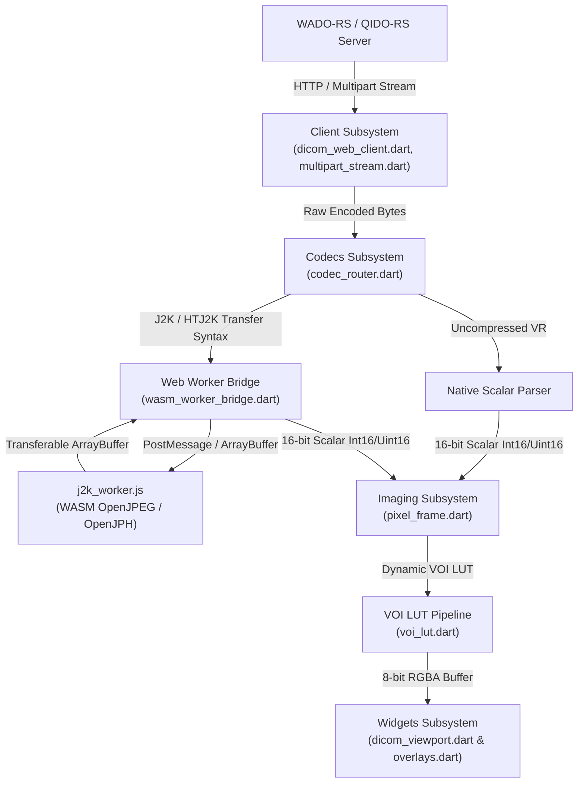

# System Design Specification (SDS) / Software Architecture Description

**Document ID:** SDS-DWK-001  
**Project:** `dicom_web_kit`  
**Regulatory Standard Alignment:** IEC 62304 Clause 5.3 / 5.4, FDA 21 CFR 820.30  

---

## 1. Executive Summary & Architectural Scope
`dicom_web_kit` is a zero-jank, high-performance DICOM medical image streaming and rendering kit built for Flutter Web and Desktop (Dart 3+ WasmGC, Skwasm/CanvasKit). This document defines the subsystem decomposition, memory lifecycle, thread isolation boundaries, and data pipelines required for medical image display.

---

## 2. System Subsystem Architecture

---

## 3. Subsystem Breakdown & Design Contracts

### 3.1 Client Subsystem (`lib/src/client/`)
* **`DicomWebClient`**: Manages asynchronous HTTP requests to DICOMweb endpoints.
* **`MultipartStreamReader`**: Parses `multipart/related; type="application/octet-stream"` and `image/jp2` byte streams without loading entire studies into memory simultaneously.

### 3.2 Codecs & Thread Isolation Subsystem (`lib/src/codecs/`)
* **`WasmWorkerBridge`**: Spawns `web/j2k_worker.js` via `package:web`. Ensures heavy frame decompression runs off the Flutter UI isolate to prevent frame stuttering.
* **`CodecRouter`**: Evaluates DICOM Transfer Syntax UID (`1.2.840.10008.1.2.4.90`, etc.) and routes payloads to WASM Workers or native decoders.

### 3.3 Imaging Subsystem (`lib/src/imaging/`)
* **`PixelFrame`**: Encapsulates raw 16-bit scalar pixel arrays (`Int16List` / `Uint16List`) and Modality Rescale Slope/Intercept ($y = m \cdot x + b$).
* **`VoiLut`**: Applies dynamic Window Center ($C$) and Window Width ($W$) formulas:
  $$y = \begin{cases} 0 & \text{if } x \le C - 0.5 - \frac{W - 1}{2} \\ 255 & \text{if } x > C - 0.5 + \frac{W - 1}{2} \\ \left(\frac{x - (C - 0.5)}{W - 1} + 0.5\right) \times 255 & \text{otherwise} \end{cases}$$
* **`WindowPresets`**: Standard clinical presets (Soft Tissue, Bone, Lung, Brain).

### 3.4 Widgets Subsystem (`lib/src/widgets/`)
* **`DicomViewport`**: Renders dynamic RGBA pixel buffers directly using Skwasm/CanvasKit `ui.ImageDescriptor.raw`.
* **`ViewportController`**: Manages pan/zoom transform states, active frame index, and window level adjustments.
* **`ViewportOverlays`**: Displays patient demographic tags, DICOM metadata, orientation markers (A/P/L/R), and scale.

---

## 4. Memory Management & Safety Contracts
1. **Zero-Copy Transfers**: Web Worker messages transfer `ArrayBuffer` ownership directly to eliminate memory duplication.
2. **Scalar Preservation**: Raw pixel data is maintained in original 16-bit precision; 8-bit quantization is performed only during viewport rendering.
