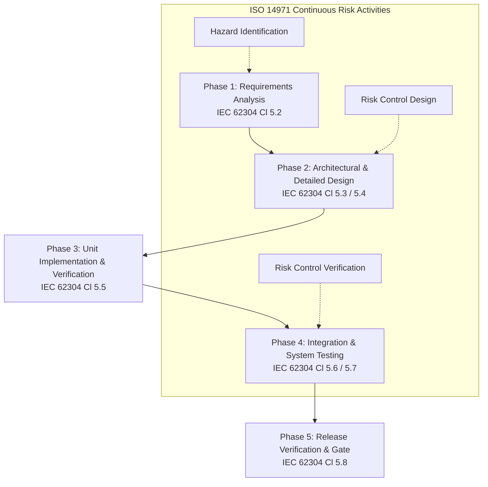

# Software Development Procedure (SOP)

**Document ID:** GSP-000  
**Project:** `dicom_flutter_radiology_kit`  
**Regulatory Standard Alignment:** IEC 62304:2006+A1:2015 (Clauses 5.1–5.8), ISO 13485:2016 Clause 7.3, FDA 21 CFR 820.30  
**Software Safety Class:** Class B (Non-life-threatening clinical review / diagnostic display aid)  

---

## 1. Purpose & Scope

### 1.1 Purpose
This Standard Operating Procedure (SOP) defines the Software Development Life Cycle (SDLC) processes, responsibilities, and quality controls for `dicom_flutter_radiology_kit`. It ensures that all software artifacts meet medical device software quality, cybersecurity, traceability, and regulatory compliance standards prior to release.

### 1.2 Scope
This procedure applies to:
- Core library code in `lib/` (client streaming, WASM codecs, scalar imaging, Flutter viewports).
- Web Worker and WebAssembly modules in `web/` (OpenJPEG/OpenJPH builds).
- Automated test suites and verification scripts in `test/`.
- Design Controls and Traceability documentation in `docs/design/`.

---

## 2. Software Safety Classification (IEC 62304 Cl. 4.3)

In accordance with **IEC 62304 Clause 4.3**, `dicom_flutter_radiology_kit` is categorized as **Software Safety Class B**:
- **Definition:** No injury or non-serious injury is possible from direct software failure; however, software outputs may inform medical diagnoses when integrated into a downstream medical device system.
- **Required Lifecycle Deliverables for Class B:**
  1. Software Development Plan & Procedures (this document).
  2. Software Requirements Specification (`docs/design/gsd_000_software_requirements_spec.md`).
  3. System & Detailed Design Specification (`docs/design/gsd_010_system_design_specification.md`).
  4. Hazard Analysis & Risk Management Plan (`docs/design/gsd_020_hazard_analysis_risk_management.md`).
  5. Verification & Validation Protocol (`docs/design/gsd_030_verification_and_validation_plan.md`).
  6. Requirements Traceability Matrix (`docs/design/gsd_040_traceability_matrix.md`).
  7. Cybersecurity & SOUP Management Plan (`docs/design/gsd_050_cybersecurity_and_soup_bom.md`).

---

## 3. Software Development Lifecycle (SDLC) Workflow

### Phase 1: Software Requirements Analysis (IEC 62304 Cl. 5.2)
1. All functional, performance, security, and interface capabilities are documented as unique requirements in `gsd_000` with identifiers (`REQ-FUN-XXX`, `REQ-PERF-XXX`, `REQ-REG-XXX`).
2. Requirements must be unambiguous, testable, and trace to user clinical needs.

### Phase 2: Software Architectural & Detailed Design (IEC 62304 Cl. 5.3 & 5.4)
1. Software architecture is decomposed into distinct subsystems (`client`, `codecs`, `imaging`, `widgets`) in `gsd_010`.
2. Off-thread boundaries between Dart isolates and Web Workers (`package:web`) must be explicitly defined to prevent UI blocking.
3. Every requirement must be allocated to at least one software component.

### Phase 3: Software Implementation & Unit Verification (IEC 62304 Cl. 5.5)
1. **Coding Standards**:
   - Adhere to effective Dart style guidelines and `flutter_lints`.
   - Maintain 16-bit scalar preservation (`Int16List`/`Uint16List`) without early 8-bit down-sampling.
2. **Unit Testing**:
   - Every core mathematical algorithm (VOI LUT windowing, rescale slope/intercept, MONOCHROME1 inversion) must have unit test coverage.
   - Unit tests are located under `test/` and run via `flutter test`.

### Phase 4: Integration & System Testing (IEC 62304 Cl. 5.6 & 5.7)
1. Verification protocols in `gsd_030` are executed to ensure end-to-end WADO-RS streaming, Web Worker decoding, and viewport rendering function accurately.
2. Visual test patterns (TG18-QC, SMPTE) verify grayscale contrast rendering accuracy.

### Phase 5: Software Release & Baseline (IEC 62304 Cl. 5.8)
1. Pre-release checklist requires:
   - Clean static analysis (`flutter analyze` with 0 issues).
   - 100% passing test suite (`flutter test`).
   - Up-to-date Requirements Traceability Matrix (`gsd_040`).
   - Git tag aligned with Semantic Versioning (`vMAJOR.MINOR.PATCH`).

---

## 4. Risk Management Integration (ISO 14971:2019)

1. **Hazard Analysis**: As new features or changes are designed, potential clinical and technical hazards (e.g., pixel truncation, worker crashes, incorrect LUT inversion) must be evaluated in `gsd_020`.
2. **Risk Control Implementation**: Software risk controls must be built directly into the codebase (e.g., strict type preservation, try-catch isolation, defensive bounds clamping).
3. **Traceability**: All risk controls must trace from hazard ID (`HAZ-XXX`) to software requirement (`REQ-XXX`) to test case (`TEST-XXX`) in `gsd_040`.

---

## 5. Software of Unknown Provenance (SOUP) Management (IEC 62304 Cl. 5.3.3)

1. Third-party packages and compiled binaries (such as `OpenJPEG WASM`, `package:web`, `http`) are classified as SOUP.
2. All SOUP components are cataloged in `docs/design/gsd_050_cybersecurity_and_soup_bom.md` with:
   - SOUP Title and Version.
   - Intended clinical/functional role.
   - Known vulnerabilities and monitoring mechanisms (CVE alerts, Dependabot).

---

## 6. Configuration Management & Change Control (IEC 62304 Cl. 8)

1. **Version Control**: Git is the official software configuration management repository.
2. **Branching Strategy**:
   - `main`: Protected production-ready branch. All merges require formal release approval, QA sign-off, and passing CI.
   - `staging`: Pre-release QA and verification branch. **No further feature additions are permitted**; only critical defect and bug fixes are allowed.
   - `dev`: Shared team codebase under active development. Developers **SHALL base all work against `dev` and submit Pull Requests against `dev`** for their contributions.
   - `feat/*`, `fix/*`: Dedicated feature and defect resolution branches branched from and merged back into `dev`.
   - **Branch Hygiene**: Merged PR branches **SHALL be deleted immediately post-merge** to prevent stale branch drift, accidental re-branching from outdated baselines, and repository clutter.
3. **Absolute CI/CD Sanity**:
   - If CI/CD fails due to newly committed code or an integrated PR, the contributing developer **SHALL be immediately responsible for restoring the build as their top priority**.
   - No additional merges into `dev` or `staging` shall proceed while the build is broken.
4. **Traceability in Commits/PRs**:
   - Commits and Pull Requests should reference the associated GitHub Issue and Requirement ID where applicable (e.g., `feat(imaging): implement linear VOI LUT [REQ-FUN-007, #1]`).

---

## 7. Audited Quality System Records & Issue Tracking (ISO 13485 Cl. 4.2 / 8.5, FDA 21 CFR 820.40 / 820.100, FDA 21 CFR Part 11)

### 7.1 System of Record & Electronic Signature Equivalency
1. The GitHub Issue Tracking System serves as the audited Quality Management System (QMS) repository of record tracking all software design, development, unit verification, system testing, defect resolution, and release activities.
2. **Electronic Signature Equivalency (FDA 21 CFR Part 11)**: By utilizing the project's issue tracking system and authenticated GitHub accounts, all contributors and team members acknowledge and consent that creating, commenting on, approving, closing, or committing against GitHub issues, pull requests, and Git commits constitutes the legally binding equivalent of a handwritten signature on an official QMS record.

### 7.2 Change Orders (CO / Work Orders)
A new Release, Installation, or alteration of configurations on shared resources/infrastructure **SHALL require a formal Work Order task request** logged as a dedicated GitHub Issue, containing:
1. **Affected System & Site**: Identification of affected software modules, environments, platforms, or site deployments.
2. **Planning Documentation**: Detailed execution plan, rollout procedure, and rollback strategy.
3. **Effective Time of Change**: Recorded timestamp of scheduled and completed change execution.
4. **Record of Verification**: Objective evidence and test results demonstrating successful verification post-change.

### 7.3 Corrective Actions (CA)
1. Any notice of process non-conformances, pipeline failures, software defects, or quality improvements **SHALL be logged and tracked as a Corrective Action (CA)** within the issue tracking system.
2. All associated engineering artifacts (commits, pull requests, test protocols, and documentation revisions) **SHALL explicitly reference the corresponding Issue number** to maintain a closed-loop audit trail.
